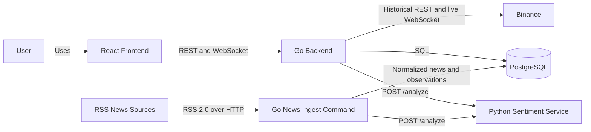
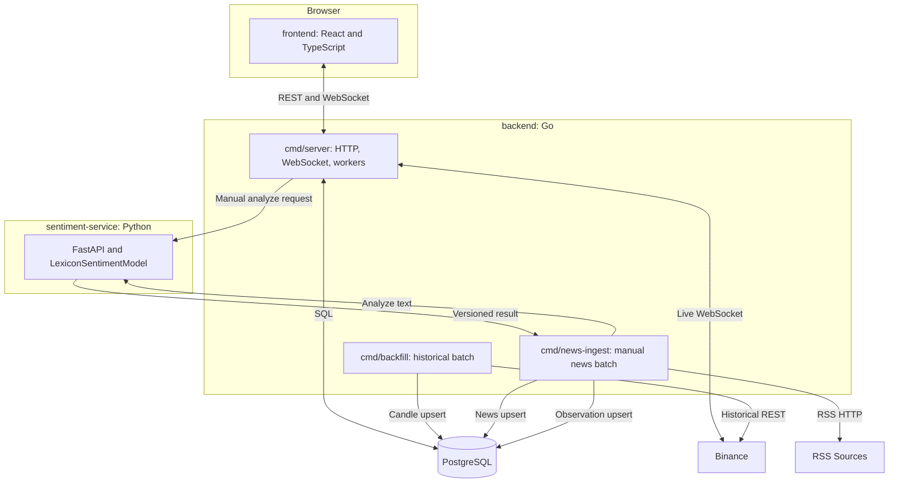
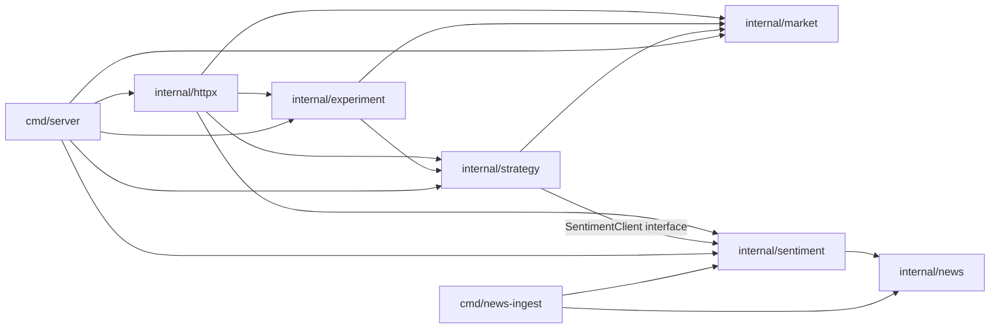
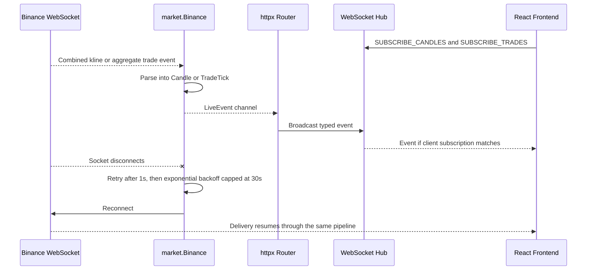
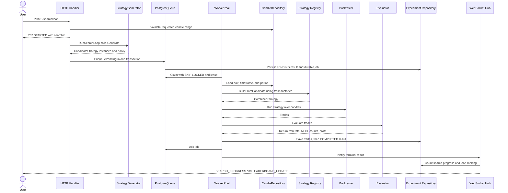
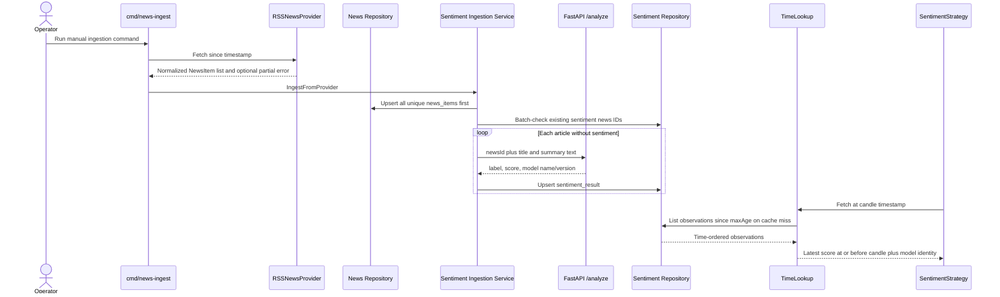
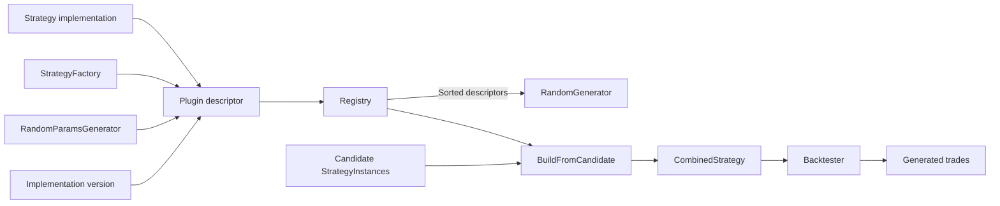

# Crypto Strategy Lab
## Final Software Architecture Report


- Project stack: Go 1.26.5 (`net/http`, pgx, WebSocket), React 19 + TypeScript + Vite, Python 3.11+ + FastAPI, and PostgreSQL (hosted on Supabase for the team environment)
- Objective: provide a repeatable laboratory for composing, backtesting, evaluating, and ranking cryptocurrency strategies, with replaceable market, search, news, and sentiment boundaries.

This report was checked against the source, migrations, and tests on the commit above. Documentation is treated as design intent; where it differs from executable code, the current code is reported as authoritative.

## 1. Introduction and Problem Context

Cryptocurrency markets operate continuously, change quickly, and expose several kinds of signals: price trend, momentum, volatility, market structure, and news sentiment. No single indicator is reliable in every regime. A useful engineering system must therefore make it inexpensive to try multiple strategies, combine them, compare them on the same historical data, and retain enough evidence to explain each result.

Crypto Strategy Lab addresses that need as an **experimentation platform**, not as an automated trading system and not as proof that any strategy is profitable. A user selects a market and timeframe, builds or generates candidate strategies, runs historical simulations, compares risk and return metrics, and inspects the resulting trades. Live charts and a news/sentiment path provide current context, while versioned experiment records support later analysis.

The primary architectural objective is changeability: a new strategy, search algorithm, market adapter, or sentiment model should have a bounded impact. This intent is stated in [System Context](architecture/01-context.md), [PLAN.md](../PLAN.md), and the ADR set, and is substantially implemented through Go interfaces, factories, package boundaries, and explicit composition in `backend/cmd/server/main.go`.

## 2. Scope and Functional Requirements

The implemented MVP covers market acquisition, strategy composition, asynchronous backtesting, ranking, trade inspection, RSS news normalization, and sentiment enrichment. Status below reflects this audited commit, not planned work.

| Capability | Status | Current implementation and evidence | Limitation |
|---|---|---|---|
| Binance historical data | Implemented | `market.Binance.FetchHistoricalCandles` paginates `/api/v3/klines`; `cmd/backfill` upserts closed candles through `PostgresCandleRepository` | Manual backfill; no automatic gap repair |
| Binance realtime data | Implemented | `Binance.StreamMarketEvents` streams klines and aggregate trades through two combined sockets | Binance is the only runtime provider |
| Multi-timeframe | Implemented | Catalog and validation support `5m`, `15m`, `1h`, `4h`; the UI renders up to four independently configured charts | Fixed catalog rather than arbitrary intervals |
| Strategy plugin boundary | Implemented | `Plugin` owns default, factory, random parameters, and implementation version; `Registry`, `RandomGenerator`, and `BuildFromCandidate` consume generic contracts | Source-level startup registration; no runtime compiled-plugin discovery |
| MA, RSI, Bollinger, S/R | Implemented | Independent types and tests under `backend/internal/strategy` | Indicator behavior is deliberately MVP-sized |
| SMC | Implemented (minimal) | `SMCStrategy` detects a simplified structure break over a swing lookback | Not a complete institutional-order-flow model |
| MACD | Implemented | `MACDStrategy`, `MACDFactory`, `MACDRandomParams`, `NewMACDPlugin`, startup registration, and tests | Rich MACD parameter controls are absent from frontend metadata |
| SentimentStrategy | Implemented | Bounded historical lookup, standalone/decorator factory, fallback, and runtime model recording | Production registers the standalone form; missing sentiment yields `HOLD` |
| Composite strategy | Implemented | `CombinedStrategy` with majority and normalized weighted policies | No strategy-specific conflict explanation in the UI |
| Random Search | Implemented | `RandomGenerator` discovers plugin descriptors and invokes their parameter generators; a seeded constructor supports deterministic tests | Production still constructs Random Search directly in the HTTP router |
| Stop conditions | Implemented (bounded MVP) | Max candidates, duration, no-improvement, context cancellation, terminal WS reasons, and no-improvement in-flight pacing exist in `RunSearchLoop` | HTTP caps runs at 200 and has no user-cancel endpoint |
| Queue and workers | Implemented | Durable `PostgresQueue`, atomic pending/job write, leases, heartbeat, retries, stale reclaim, and configurable 1-64 worker pool | Server and workers are composed in one binary; queue is effectively unbounded |
| Backtesting | Implemented | Long/short simulation, SL/TP, gap handling, fees, slippage, force-close, no pyramiding, and look-ahead prevention | No portfolio-level or order-book simulation |
| Evaluation | Implemented (core) | Return, win rate, maximum drawdown, trade count, wins/losses, total profit | Sharpe ratio and profit factor described in ADR-0003 are not implemented |
| Leaderboard Top-K | Implemented | Ranked Top-100 REST snapshot, Top-10 WS update, frontend Top-5/10/20 views | Ranking is one fixed weighted formula |
| Persisted trades | Implemented | `experiment_trades`; trades are saved before a result becomes `COMPLETED` | Old pre-migration runs may have no trade rows |
| Trade visualization | Implemented | Trade table plus clickable entry/exit markers on candles loaded from the experiment's pair/timeframe | Chart adds a generic MA20 line, not every selected strategy's indicator/zones |
| RSS NewsProvider | Implemented | `RSSNewsProvider` parses configured RSS 2.0 feeds with stable IDs and partial-feed isolation | Trigger is manual `cmd/news-ingest`; no scheduler |
| Normalized news storage | Implemented | `news_items` stores article metadata/content separately from sentiment observations | No backend `GET /news` contract |
| `relatedCoins` | Implemented (limited) | Deterministic BTC/ETH/SOL extraction from title, summary, and categories | Deliberately small vocabulary |
| Sentiment service | Implemented | FastAPI `/analyze` uses deterministic `crypto-lexicon/v2`; Go validates the response | Lexicon model is an MVP, not a financial transformer |
| Sentiment provenance | Implemented in backend/API | Consumed `{name,version}` identities are persisted on each result, including mixed versions | Frontend provenance modal does not render `sentimentModels` |
| Pair/timeframe provenance | Implemented | Runtime pair, timeframe, and period survive result storage/read-back and drive chart replay | Unrecoverable legacy values remain empty by design |

## 3. Architecture Overview

### 3.1 System Context

The main actor is an authenticated analyst/student using the browser dashboard. Binance and RSS publishers are external data systems. PostgreSQL is the durable system of record. The Python sentiment service is project-owned but separately deployable.



The user never connects directly to Binance, PostgreSQL, RSS sources, or the Python service. This protects browser contracts from external wire formats and credentials.

### 3.2 Container Architecture



The Go backend is a modular monolith. `cmd/server`, `cmd/backfill`, and `cmd/news-ingest` are separate executable entrypoints over shared domain packages. The Python service is split because model implementation and packaging are better supported by Python; it has no database access.

### 3.3 Module Decomposition



Dependencies point toward normalized domain contracts. Strategy code sees `market.Candle`, not Binance payloads. Experiment code receives a built strategy and candle repository, not exchange clients. News collection returns `NewsItem`; sentiment inference does not parse RSS.

## 4. Component Responsibilities

| Component | Owns | Must not own |
|---|---|---|
| `internal/market` | Market catalog, normalized candles/trade ticks, provider interfaces, Binance REST/WS adapter, reconnect policy, candle persistence/cache | Strategy rules, experiment ranking, React chart rendering |
| `internal/strategy` | Signal contract, strategy implementations, plugin registry/factories, candidate shape, random generator, composite policies, sentiment strategy adapter | Binance calls, SQL, experiment lifecycle, HTTP routing |
| `internal/experiment` | Jobs, queue contracts, worker lifecycle, backtest execution, metrics, ranking, result/trade persistence, runtime metrics | Indicator formulas, RSS parsing, external market protocols |
| `internal/news` | Source-neutral `NewsItem`, `NewsProvider`, RSS normalization, stable IDs, related-coin extraction, news repository | Sentiment model logic, strategy decisions, frontend APIs |
| `internal/sentiment` | Go REST client, ingestion orchestration, sentiment observation persistence, time-aligned lookup and score adaptation | RSS-specific parsing, Python model internals, raw article storage in `sentiment_results` |
| `internal/httpx` | REST contracts, authentication gate integration, WebSocket hub/subscriptions, dependency wiring at the transport boundary, request/operational endpoints | Indicator math, backtest simulation, direct SQL |
| `frontend` | User workflows, charts, forms, REST/WS consumption, explicit LIVE versus DEMO presentation | Ranking, simulation, direct Binance/database/model access |
| PostgreSQL | Durable users, candles, experiments, jobs, trades, news, and sentiment observations | Model inference and UI state |
| `sentiment-service` | Text classification and truthful model name/version | News collection, Go database access, candle-time lookup, strategy policy |

`backend/cmd/server/main.go` is the composition root: it creates concrete repositories/adapters and registers plugins. This file may know which implementations are deployed, but business behavior remains in the packages above.

## 5. Main Runtime Flows

### 5.1 Realtime Market Flow



`httpx.NewRouterWithContext` starts `StreamMarketEvents` for all catalog symbols and timeframes. `Hub` maintains bounded per-client queues (64 ordinary events and 128 trade events), filters by subscriptions, and drops events for a slow client instead of blocking every client. The frontend WebSocket manager also reconnects its backend socket and restores subscriptions. Upstream Binance reconnect state is not currently exposed as a metric or explicit browser event.

### 5.2 Search / Backtest Flow



`POST /search/start` follows the same queue-worker path but accepts one explicit candidate and does not call a generator. Workers derive `Config.Window` from the resolved candidate's `LookbackAware.MinLookback`, exclude the current candle from strategy input, and persist trades before advertising success. Infrastructure failures are Nacked for bounded retry; deterministic candidate-build failures become terminal.

### 5.3 News / Sentiment Flow



News persistence happens before enrichment, so an unavailable Python service does not lose collected articles. Existing sentiment IDs are checked in one batch, making repeated ingestion perform zero model calls when there is no new work. `TimeLookup` excludes future observations and observations older than 24 hours. It loads a range on a cache miss and reuses the in-memory sorted slice across ascending candle lookups, normally reducing a sentiment backtest to one observation query rather than one query per candle.

## 6. Strategy and Plugin Architecture

`strategy.Strategy` is intentionally small: `Name() string` and `Analyze([]market.Candle) Signal`. Optional `LookbackAware` reports required history. A `StrategyFactory` builds a fresh parameterized instance. The source-level `Plugin` descriptor combines the strategy name, default implementation, factory, strategy-owned `RandomParamsGenerator`, and static Go implementation version. `Registry.RegisterPlugin(plugin)` validates the complete descriptor, rejects duplicate or incomplete registrations, and stores all metadata atomically.

`Registry.Plugins()` returns descriptors sorted by name. `RandomGenerator` selects from that collection and invokes each selected plugin's parameter generator; it contains no concrete MA/RSI/MACD dispatch. `Registry.VersionsFor()` resolves experiment strategy-version provenance from the same descriptor. `BuildFromCandidate` remains generic: it asks the registry to build every `StrategyInstance`, then wraps the results in `CombinedStrategy`, allowing repeated types with independent parameters and weights.

`backend/cmd/server/main.go` currently registers exactly seven strategies: MA, RSI, Bollinger, SR, SMC, MACD, and Sentiment. Candidate selection derives its available count from the registry. `TestRandomGeneratorSupportsEightPluginsWithoutCountAssumptions` proves that an eighth plugin registers, is selected, and builds normally.

`CombinedStrategy` implements the same `Strategy` interface. It delegates to child strategies and applies either `MajorityPolicy` or `WeightedPolicy`; weights are normalized, with equal-weight fallback. Backtester and Evaluator therefore operate on a single strategy abstraction whether the candidate contains one or many algorithms.



### Adding a MACD-like strategy today

MACD is a real extension example in this repository. Adding another strategy follows the current source-level recipe:

1. Implement `Strategy` and, where needed, `LookbackAware` under `backend/internal/strategy`.
2. Provide its `StrategyFactory`.
3. Provide a strategy-owned `RandomParamsGenerator`, or deliberately use `NoRandomParams`.
4. Declare the truthful static implementation version in its plugin descriptor.
5. Register that descriptor in `backend/cmd/server/main.go` and add focused tests.

No strategy-specific modification is required in `RandomGenerator`, `CombinedStrategy`, `WorkerPool`, `Backtester`, `Evaluator`, ranking, or experiment persistence. `TestPluginExtensionPathGeneratesBuildsAndExecutesTestMomentum` defines an external test plugin with its own factory and parameter generator, then passes it through normal generation, construction, and composite execution. The cross-package experiment proof continues through Backtester, Evaluator, and ranking. `NewRandomGeneratorWithSeed` and its test prove deterministic output for the same seed and plugin set, including reverse registration order.

The composition-root registration is still a source edit. This is startup registration of compiled-in Go implementations, not runtime binary plugin discovery. Rich frontend controls may require optional presentation metadata, but generic backend generation and execution do not.

## 7. Search and Experiment Architecture

| Element | Responsibility | Why separate |
|---|---|---|
| `CandidateStrategy` | Immutable candidate ID, strategy instances, parameters, weights, and policy | Separates a serializable experiment specification from executable strategy objects |
| `StrategyGenerator` | Produces candidates through `Generate()` | Search policy can change without changing execution |
| `RandomGenerator` | Samples 2-3 registered strategies, parameters, weights, and policy | Keeps the MVP algorithm isolated behind the generator contract |
| `RunSearchLoop` | Deduplicates locally, evaluates OR stop checks, creates provenance, enqueues work | Keeps generation/control flow out of HTTP and workers |
| `Queue` / `PostgresQueue` | Durable job handoff, atomic pending write, claim, Ack/Nack, retry, lease | Decouples request latency and candidate production from execution |
| `WorkerPool` | Concurrent claims, lifecycle transitions, strategy construction, orchestration, panic isolation | Concurrency/retry concerns do not enter strategies or Backtester |
| `Backtester` | Converts signals and candles into realistic trades | Simulation correctness is independent of scoring |
| `Evaluator` | Converts trades into comparable metrics | Metrics can evolve without changing execution rules |
| `Rank` / repository ordering | Applies eligibility and weighted score | One backend definition prevents clients from inventing ranking logic |
| Leaderboard | Reads bounded ranked results and pushes Top-10 updates | Read/display concerns stay outside execution |

`RandomGenerator` implements `StrategyGenerator`, and `RunSearchLoop` accepts the interface. A Domain-Guided or Genetic generator can therefore emit the same `CandidateStrategy` and reuse the queue, workers, Backtester, Evaluator, repository, and leaderboard. However, current production wiring constructs `RandomGenerator` directly inside `httpx.NewRouterWithContext`; replacing it requires changing that wiring or adding generator dependency injection. The Backtester does not change.

For the current Random Search implementation, registry discovery is dynamic in count: candidate selection uses sorted `Registry.Plugins()`, so registering another strategy does not require changing generic selection logic. Production randomness uses `crypto/rand`; tests can inject a deterministic source through `NewRandomGeneratorWithSeed`. Before enqueueing, `RunSearchLoop` asks its `PluginVersionResolver` for the selected implementation versions, and production supplies the registry. Sentiment model identities remain separate runtime provenance collected after execution.

Stop checks use OR semantics: the first configured condition stops further generation while queued work finishes. Max candidate count is reliable and finite; duration and context checks also exist. When `NoImprovementLimit` is configured, `RunSearchLoop` observes terminal worker results and caps unresolved candidates at that limit, preserving worker parallelism while preventing the producer from enqueueing the entire run before improvement can be measured. There is still no HTTP user-cancel operation, and duplicate generation is accepted after ten unsuccessful retries.

## 8. Data Architecture and Reproducibility

PostgreSQL is the authoritative store. JSON-shaped strategy configuration is kept inline with result rows because it is read as a provenance snapshot, while high-cardinality trades and independent news/sentiment records use separate tables.

| Data | Storage | Purpose and key |
|---|---|---|
| Candles | `candles` (`0001_init.sql`) | Closed historical OHLCV, primary key `(symbol,timeframe,open_time)` |
| Experiments/results | `experiments` (`0001`, `0007`, `0008`, `0012`, `0013`) | Candidate lifecycle, metrics, pair/timeframe/period, strategy and model provenance |
| Jobs | `experiment_jobs` (`0006`) | Durable compact payload, status, attempts, availability, lease, last error; successful jobs are deleted on Ack |
| Strategy instances/parameters | `experiments.instances` JSON text and job payload JSONB | Exact type, parameter map, weight, and combination policy used by the candidate |
| Trades | `experiment_trades` (`0010`) | Entry/exit times and prices, direction, size, SL/TP, costs, slippage, and profit, linked to experiment |
| News | `news_items` (`0011`) | Stable article ID, title, content, source, URL, publish time, JSONB related coins, creation time |
| Sentiment observations | `sentiment_results` (`0002`, `0009`) | Article ID, publish time, label/score, model identity, analysis time, and display metadata |

### Experiment provenance

For new results, `experiment.Result` and the REST API expose:

- `pair` and `timeframe`, identifying the market series;
- `datasetPeriod`, the exact requested Unix-millisecond range;
- `instances` and `policy`, preserving strategy types, parameters, weights, and composition;
- `strategyVersions`, preserving declared Go implementation versions;
- `sentimentModels`, preserving every distinct runtime model `{name,version}` actually consumed;
- metrics and a separately retrievable generated trade list.

The worker records sentiment identities from the fresh resolved strategy after execution. `SentimentStrategy` protects its identity set with a mutex, and `CombinedStrategy` returns a deterministic unique sorted list, so mixed model versions are represented rather than silently collapsed. Non-sentiment or fallback-only runs store an empty list.

Migrations use safe defaults for old rows. `0013` leaves unknown pair/timeframe empty; `0014` backfills only verifiable values from retained jobs or trades. Repository reads normalize legacy JSON encodings. Ineligible legacy and zero-trade rows remain readable but cannot outrank reproducible completed results.

This meets the rubric's traceability requirement. It is not yet bit-for-bit scientific reproduction: candles are upserted rather than immutable snapshots, strategy versions are manually maintained labels rather than code hashes/commit SHAs, and completed results do not retain every execution setting (for example capital, fee, slippage, SL/TP) after their successful job row is Acked. The persisted trades still provide the actual execution outcome.

## 9. Architectural Drivers / Quality Attributes

### 9.1 Modifiability

- **Problem:** strategy and policy variants should grow without type-switch changes across the system.
- **Current solution:** `Strategy`, `StrategyFactory`, the validated `Plugin` descriptor, `Registry.RegisterPlugin`, strategy-owned parameter generators and versions, `StrategyGenerator`, `CombinationPolicy`, and source-level composition.
- **Evidence:** `backend/internal/strategy/plugin.go`, `strategy.go`, `candidate.go`, `combination.go`, `random_generator.go`, `random_generator_test.go`, and `backend/internal/experiment/extensibility_test.go`.
- **Assessment:** strongly satisfied for source-level extensibility. A new plugin can be generated, built, composed, backtested, evaluated, and ranked without concrete-name changes in generic infrastructure; an eighth-plugin test proves registry-size independence.
- **Limitation:** registration is explicit in `cmd/server/main.go`; there is no runtime compiled-plugin discovery/loading, and rich strategy-specific frontend controls may still need optional UI metadata.

### 9.2 Scalability

- **Problem:** candidate execution should not remain one serial request-bound loop.
- **Current solution:** asynchronous durable jobs, `SKIP LOCKED` claims, leases/retries, configurable 1-64 goroutines, and safe claims across backend processes.
- **Evidence:** `experiment.PostgresQueue`, `WorkerPool`, `cmd/perf`, and [performance evidence](performance-evidence.md).
- **Limitation:** the API caps one search at 200 candidates; in-flight pacing applies only when no-improvement is configured; server and workers share one deployment; 100,000 candidates are not supported as-is.

### 9.3 Realtime

- **Problem:** four live views and search progress should update without polling external sources.
- **Current solution:** Binance combined WebSockets, normalized event channels, one authenticated tagged backend WebSocket, and client subscriptions.
- **Evidence:** `market.Binance.StreamMarketEvents`, `httpx.Hub`, `httpx.serveWebSocket`, and `frontend/src/shared/ws/index.ts`.
- **Limitation:** live events are transient and slow-client queues drop rather than replay; upstream Binance connection state is not sent to the UI.

### 9.4 Reliability

- **Problem:** external disconnects, process crashes, malformed events, and worker failures must not cascade.
- **Current solution:** bounded Binance reconnect, malformed-event skipping, durable leased jobs, retry/heartbeat/reclaim, worker and observer panic isolation, news-before-sentiment persistence, and sentiment fallback.
- **Evidence:** `market.binance.go`, `experiment.postgres_queue.go`, `experiment.worker.go`, `sentiment.service.go`, and reconnect/failure tests.
- **Limitation:** no circuit breaker; ingestion stops after an analyzer failure; sentiment errors are not retried; no explicit Binance outage status for users.

### 9.5 Performance

- **Problem:** repeated candidate runs reuse the same candle ranges and sentiment timeline, while leaderboard reads repeat frequently.
- **Current solution:** bounded/coalesced 128-entry candle cache for one minute, write-invalidated leaderboard cache for three seconds, in-memory time-sorted sentiment lookup cache for one minute, batch candle/news writes, and concurrent workers.
- **Evidence:** `market.CachedCandleRepository`, `experiment.CachedRepository`, `sentiment.TimeLookup`, and `docs/performance-evidence.md`.
- **Limitation:** the sentiment slice has no explicit entry bound and is protected by one mutex; fresh observations written through the server do not call `TimeLookup.Invalidate`, so strategy lookup can lag by up to its one-minute TTL.

### 9.6 Maintainability

- **Problem:** a small course team needs understandable ownership without microservice overhead.
- **Current solution:** modular-monolith packages, small interfaces, separate commands, repository abstractions, ADRs, and tests beside behavior.
- **Evidence:** `backend/internal/{market,strategy,experiment,news,sentiment,httpx}` and [ADR-0005](adr/0005-modular-monolith-not-microservices.md).
- **Limitation:** package boundaries do not prevent all cross-domain imports; the composition root and HTTP router still choose some concrete policies directly.

### 9.7 Observability

- **Problem:** operators need liveness/readiness, request correlation, queue state, failures, progress, and latency.
- **Current solution:** `/health`, database-backed `/ready`, request IDs and duration logs, structured job identifiers/status logs, `/metrics`, `/metrics/prometheus`, WS progress, and queue/runtime counters with p50/p95 timings.
- **Evidence:** `backend/internal/httpx/observability.go`, `experiment.RuntimeMetrics`, `Hub.JobUpdated`, and `PostgresQueue.Stats`.
- **Limitation:** metrics are process-local and reset on restart; no Prometheus deployment, traces, alerts, per-feed metrics, or upstream Binance reconnect counter is included.

## 10. Architectural Decisions

| ADR | Decision | Context and rationale | Trade-off / consequence |
|---|---|---|---|
| [ADR-0001](adr/0001-market-data-adapter.md) | Normalize market access behind provider/adapter contracts | Isolate Binance wire formats and rate/reconnect concerns | Replacement is bounded, but current server/backfill wiring and source-less candle key need work for simultaneous providers |
| [ADR-0002](adr/0002-strategy-plugin-registry.md) | Complete source-level plugin descriptor plus validated registry | Keep construction, random search space, and implementation version with each strategy; eliminate concrete-name dispatch from generic search | Startup registration remains explicit; no runtime compiled-plugin loading |
| [ADR-0003](adr/0003-separate-backtester-evaluator.md) | Separate simulation from measurement | Trade correctness and metric evolution change for different reasons | Adds a stable `[]Trade` contract; ADR mentions Sharpe/profit factor that current Evaluator lacks |
| [ADR-0004](adr/0004-inprocess-job-queue-not-kafka.md) | Original in-memory queue behind an interface | Establish asynchronous execution without a broker | Superseded by ADR-0013; in-memory queue remains for tests |
| [ADR-0005](adr/0005-modular-monolith-not-microservices.md) | One Go modular monolith; Python sentiment separate | Small team and demo do not justify per-domain services | Simpler operation, but API and workers cannot yet scale independently |
| [ADR-0006](adr/0006-separate-sentiment-service.md) | Python owns inference; Go owns news and observation projections | Preserve Python model ecosystem and isolate news collection from inference | Extra process/network failure; explicit graceful degradation required |
| [ADR-0007](adr/0007-simple-session-auth.md) | Minimal bcrypt user accounts and one-hour JWT cookie | Prevent anonymous compute use without enterprise identity scope | No roles, reset, OAuth, or token revocation model |
| [ADR-0008](adr/0008-websocket-for-realtime.md) | One tagged WebSocket for market and experiment events | Avoid polling and multiple sockets | Client reconnect is custom; subscriptions are now implemented and restored after reconnect |
| [ADR-0009](adr/0009-experiment-provenance-storage.md) | Store provenance inline on result and trades separately | Leaderboard entries must remain attributable | Version bumps are manual; full data/config immutability is not guaranteed |
| [ADR-0010](adr/0010-no-cqrs-event-sourcing.md) | Plain CRUD, no CQRS/event sourcing | Read/write shapes and scale do not justify replay machinery | No complete state-transition audit log |
| [ADR-0011](adr/0011-search-loop-stop-conditions.md) | Configurable OR stop checks, WS/runtime observation, and no-improvement in-flight pacing | Bound continuous search and ensure completed results can affect generation before the run is fully queued | No user cancel; pacing is tied to the configured no-improvement limit |
| [ADR-0012](adr/0012-supabase-postgres-not-sqlite.md) | Managed shared PostgreSQL used only by Go | Team needs one shared durable source of truth | Network dependency and secret management; frontend remains isolated from database |
| [ADR-0013](adr/0013-postgres-durable-queue-and-local-caches.md) | Durable Postgres jobs and local caches, not Redis/Kafka | Close crash windows while keeping one operational data service | Polling/local cache trade-offs; the sentiment slice remains unbounded and can lag writes by its one-minute TTL |

The architecture pages and ADR implementation notes have been synchronized
with the current source. Historical decisions that evolved, notably WebSocket
subscriptions and sentiment cache details, are retained with explicit
current-state notes rather than erased.

## 11. Eight Central Architecture Questions

### 11.1 How is a new Strategy such as MACD added?

Implement `Strategy` (and usually `LookbackAware`), provide a `StrategyFactory`, define a valid `RandomParamsGenerator` or use `NoRandomParams`, declare the truthful Go implementation version in a `Plugin`, test it, and register the descriptor in `cmd/server/main.go`. RandomGenerator discovers it through the registry; Backtester, Evaluator, WorkerPool, queue, repository, ranking, and API result contracts require no strategy-specific modification. `MACDStrategy` is the real built-in example, while the external `TestMomentum` and cross-package experiment tests prove generation and downstream execution. Optional frontend metadata is needed only for rich controls. This remains source-level startup registration, not runtime binary loading.

### 11.2 How can Random Search be replaced by Domain-Guided or Genetic Search?

Create another `StrategyGenerator` that returns `CandidateStrategy`. `experiment.RunSearchLoop` already depends on that interface, and workers consume candidates rather than generator internals. Current production does hardcode `NewRandomGenerator` in `httpx.NewRouterWithContext`, so the router/composition wiring must be changed or made injectable. The Backtester requires no modification.

### 11.3 How can Binance be replaced or supplemented by OKX? Does frontend change?

For replacement, implement the historical and live market contracts in `internal/market`, normalize payloads to `Candle`/`LiveEvent`, and change concrete selection in `cmd/server/main.go` and `cmd/backfill`. REST/WS browser payloads can remain unchanged, so the frontend need not change for the same symbols/timeframes. Supplementing Binance is not fully plug-and-play today: the router accepts one live provider, the catalog is static, and candle identity has no exchange/source dimension. Simultaneous sources therefore require aggregation/selection and a source-aware storage decision.

### 11.4 What happens at 100,000 candidates instead of about 100?

The current API rejects more than 200, so 100,000 cannot run today. The durable queue and `SKIP LOCKED` claims provide a useful execution foundation and allow more worker processes to claim safely, while Backtester/Evaluator remain unchanged. No-improvement runs now bound unresolved candidates by the configured limit, but a real 100,000-candidate design still needs general admission control, persisted search-run coordination/cancellation, independently deployed workers, database/index/write-capacity validation, and retention/cache planning. Increasing `BACKTEST_WORKERS` alone is insufficient.

### 11.5 If News collection or sentiment service fails, can the Market Chart continue?

Yes. RSS ingestion is a manually invoked process separate from `cmd/server`; market REST/WS paths have no dependency on RSS or FastAPI. News is persisted before sentiment calls, and a failed feed returns partial valid items. The Go server does not contact FastAPI during startup. A sentiment lookup failure falls back to the decorated base strategy or `HOLD`. The News tab can show an error while the Market tab remains operational.

### 11.6 If the Sentiment Model changes, does the Strategy Engine change?

No, provided `/analyze` preserves its label, score, model identity, and timestamp contract. Python can replace `LexiconSentimentModel`; the Go client stores the returned identity and `TimeLookup` continues adapting observations to the strategy's directional 0..1 score. A breaking response or scoring-semantics change belongs in the Go sentiment adapter, not in general strategy/backtest code. Experiments record the actual model identities consumed.

### 11.7 How does the system recover from Binance WebSocket disconnects?

Both `StreamLiveCandles` and the production `StreamMarketEvents` path retry inside `internal/market`. A successful connection resets delay to one second; repeated failures double the delay up to 30 seconds. The event channel remains alive, delivery resumes after reconnection, malformed events are skipped, and context cancellation closes cleanly. `TestStreamMarketEventsReconnectsAndResumesAfterDisconnect` proves the production path with a local WebSocket server and no Binance network.

### 11.8 How is a Leaderboard result traced to its inputs and outputs?

Read `GET /experiments/{id}` for `pair`, `timeframe`, `datasetPeriod`, exact `instances` (parameters/weights), `policy`, `strategyVersions`, and applicable `sentimentModels`. Read `GET /experiments/{id}/trades` for the generated entries/exits and execution details. `WorkerPool.run`, `PostgresRepository`, migrations `0008`, `0010`, `0012`, `0013`, and `0014`, and repository/API tests prove write/read behavior. `BacktestChart` uses the persisted pair/timeframe/range. Legacy unknown values remain empty and those rows are excluded from competitive ranking.

## 12. Failure and Evolution Scenarios

| Scenario | Trigger | Expected current behavior | Mechanism and evidence |
|---|---|---|---|
| Binance disconnect | Either combined socket closes/errors | Process remains alive; adapter retries; events resume; cancellation closes stream | `streamCombined`, bounded backoff, `binance_internal_test.go` reconnect/resumption test |
| One RSS feed fails | HTTP error, invalid XML, or malformed source | Valid feeds/items continue; error reports failed-feed count; CLI logs a partial warning | `RSSFetchError`, `RSSNewsProvider.Fetch`, `TestRSSNewsProviderReturnsValidItemsWhenAnotherFeedFails` |
| Sentiment service unavailable | `/analyze` network/non-200 failure | News already stored; ingestion reports error; server/chart remain available; sentiment strategy falls back | `Service.IngestNews`, `Client.Analyze`, `SentimentStrategy.Analyze`, client/ingestion/fallback tests |
| Add strategy | New indicator required | Add implementation, factory, random-parameter generator, version, tests, and one startup `Plugin` registration; generic generation/execution remains unchanged | `Plugin`, `RegisterPlugin`, `BuildFromCandidate`, MACD, TestMomentum, and cross-package extension tests |
| Change generator | Domain-guided/genetic candidate policy | Implement `StrategyGenerator`; change current router/composition selection only | `candidate.go`, `RunSearchLoop`; Backtester remains unaware |
| Increase worker count | More concurrent backtests required | Set worker count from 1 to 64; multiple server processes can claim distinct jobs | `envInt`, `WorkerPool.Start`, `PostgresQueue.claim`; performance runner and queue tests |
| Worker/process failure | Panic, transient DB error, lost lease | Panic is isolated; infrastructure failure Nacks; stale lease is reclaimed; third failed claim marks result failed | `WorkerPool.run`, `PostgresQueue.Nack/claim/Heartbeat`, worker and Postgres queue tests |

Scaling worker count should follow observed queue wait and execution latency, not an assumption that more concurrency is always faster. Independent worker deployment is a future evolution because the current executable also hosts HTTP and live streams.

## 13. Testing and Architecture Evidence

The test suite includes focused architectural proofs rather than relying only on isolated indicator tests:

- **Reconnect and resumption:** `backend/internal/market/binance_internal_test.go` forces disconnects on a local WebSocket server, verifies reconnect, resumed production `StreamMarketEvents` delivery, bounded backoff, and clean cancellation.
- **Plugin extension:** `backend/internal/strategy/plugin_test.go` validates complete descriptors and factory-valid generated parameters. `random_generator_test.go` registers external `TestMomentum`, proves generation/construction/composite execution, supports eight plugins, and verifies same-seed determinism independent of registration order. MACD tests prove the real built-in extension, and `backend/internal/experiment/extensibility_test.go` continues through Backtester, Evaluator, and ranking.
- **Queue/workers:** `experiment/queue_test.go`, `worker_test.go`, and conditional Postgres runtime tests cover cancellation, panic isolation, retries, leases, atomic pending enqueue, trade persistence, and per-candidate lookback.
- **Experiment provenance:** `postgres_repository_test.go`, `worker_test.go`, and `httpx/experiment_test.go` cover pair/timeframe distinction, safe legacy empties, runtime sentiment models, repository round-trip, API serialization, and real trade retrieval.
- **News/idempotency:** `news/rss_test.go`, `news/postgres_repository_test.go`, and `sentiment/news_ingestion_test.go` cover normalization, related coins, stable duplicate handling, batch sentiment skipping, news-before-analysis persistence, analyzer failure, and partial feeds.
- **Sentiment fallback/provenance:** `sentiment/client_test.go`, `lookup_test.go`, optional real-Postgres runtime test, and `strategy/sentiment_test.go` cover service failure, point-in-time selection, future/stale exclusion, range-cache reuse, fallback, race-safe mixed model identities, and score mapping.
- **Frontend contracts:** WebSocket subscription tests, News live/empty-state tests, API payload tests, and `BacktestChart.test.tsx` verify actual pair/timeframe candle loading rather than a hardcoded interval.
- **Python model:** `sentiment-service/tests/test_model.py` checks positive, negative, neutral, realistic headlines, and model version.

`cmd/perf` is a repeatable architecture measurement, not a production capacity claim. The recorded baseline in [performance-evidence.md](performance-evidence.md) shows that the same in-memory pipeline benefits from three workers compared with one while explicitly excluding network/database contention.

## 14. End-to-End Demo Scenario

The following script is supported by current main when PostgreSQL migrations and historical data are prepared:

1. Apply `backend/migrations/0001_init.sql` through `0014_experiment_market_context_backfill.sql` in order.
2. Start the Python service with `uv run uvicorn app.main:app --reload --port 8000` from `sentiment-service`.
3. Backfill BTCUSDT for the desired supported intervals with `go run ./cmd/backfill` from `backend`.
4. Configure one or more RSS URLs and run `go run ./cmd/news-ingest`; alternatively use the explicitly labelled local demo RSS fixtures. Repeating the command skips already analyzed IDs.
5. Start the Go server with `go run ./cmd/server`, then the frontend with `npm run dev`; register/login and remain in LIVE mode.
6. Open Market and set BTCUSDT charts to multiple choices among 5m, 15m, 1h, and 4h. Historical REST data is followed by subscribed live updates.
7. Open Strategy, create/select technical and Sentiment instances, choose majority or weighted composition, and start the explicit candidate backtest. This builder currently submits a fixed 1h/180-day context.
8. Separately start Random Search, choose its timeframe and 2-200 candidate limit, and watch real `SEARCH_PROGRESS` and leaderboard updates. The random generator chooses from all registered strategies; it does not constrain itself to the manually selected builder set.
9. Open a top eligible result in Backtests. Inspect metrics/provenance, fetch its real trade table, click a trade, and verify ENTRY/EXIT markers over candles loaded with that result's pair/timeframe/period.
10. Open News to view analyzed observations from the last 24 hours and their sentiment breakdown. The page reads `sentiment_results`, not the independent full `news_items` table.

Known demo gaps: no UI trigger/scheduler for RSS, no direct news-items API, no user cancellation, the provenance modal omits `sentimentModels` despite API support, and the trade chart does not render every strategy-specific indicator or support/resistance zone.

## 15. Current Limitations and Future Evolution

### Current Limitations

- Reproducibility is already supported through persisted market context, strategy parameters, implementation versions, sentiment model identities, and generated trades. A future enhancement would be to strengthen this further with immutable dataset snapshots and more complete retention of execution configuration.
- The current evaluation layer covers the core metrics used by the project, including return, win rate, maximum drawdown, trade count, wins/losses, and total profit. Additional metrics such as Sharpe ratio and profit factor can be added later without changing the Backtester architecture.
- Backend provenance and normalized news data are already persisted and available for system use. The current frontend focuses on the main demo flow, while richer presentation of `sentimentModels`, full article content, and `relatedCoins` can be added as a UI extension.

### Future Extensions

- Add an OKX adapter, provider selection, source-aware market identity, and optional aggregation without changing normalized frontend contracts.
- Inject a Domain-Guided or Genetic `StrategyGenerator`; add a persisted search coordinator, cancellation, strict deduplication, and general admission/in-flight limits for much larger runs.
- Split workers from the HTTP/live-stream process when independent scaling is justified; benchmark PostgreSQL contention before introducing a broker.
- Add scheduled RSS ingestion and a read-only news API over `news_items`.
- Replace the lexicon with a stronger versioned model behind the same FastAPI contract.
- Store immutable dataset identifiers/hashes, code artifact identity, and complete execution configuration for stronger scientific reproduction.
- Expose sentiment model provenance and source health in the UI and operations tooling.

## 16. Team Contribution

Contributor identities are not inferred from commit authorship in this report. Complete the names before submission.

| Responsibility area | Contributor | Evidence scope |
|---|---|---|
| Market + News/Sentiment | `23127345 - Võ Thành Đạt` | Binance adapters/backfill/reconnect, RSS/news storage, Go sentiment path, Python service |
| Strategy + Search | `23127346 - Vũ Thành Đạt` | Strategy plugins, registry/factories, composites, generators, search-loop policy |
| Experiment + Backtest | `23127303 - Hồ Tấn Quốc` | Queue/workers, backtesting, evaluation, ranking, persistence/provenance/metrics |
| Frontend + Integration | `21127040 - Trịnh Hạnh` | Charts, strategy/search UX, leaderboard/trades, news/sentiment presentation, REST/WS integration |

Cross-domain changes should be reviewed by both affected responsibility owners, especially Strategy-Experiment contracts and Sentiment-Experiment provenance.

## 17. Conclusion

Crypto Strategy Lab meets its principal architectural objective at MVP scale. Normalized market contracts isolate Binance; factories and a registry isolate strategy construction; a generator contract isolates candidate creation; durable jobs and workers isolate execution from requests; Backtester, Evaluator, repository, and ranking each own one stage; and the news/sentiment split isolates source collection from model inference. PostgreSQL records the experiment and trade evidence needed to inspect a leaderboard result.

The system is not yet a 100,000-candidate platform, a multi-exchange product, or a scientifically immutable experiment store, and the report does not present it as one. Its current architecture does provide a credible, tested path for evolving in those directions. New ideas enter a repeatable loop without rewriting every stage:

```text
Generate -> Execute -> Measure -> Rank -> Improve
```
